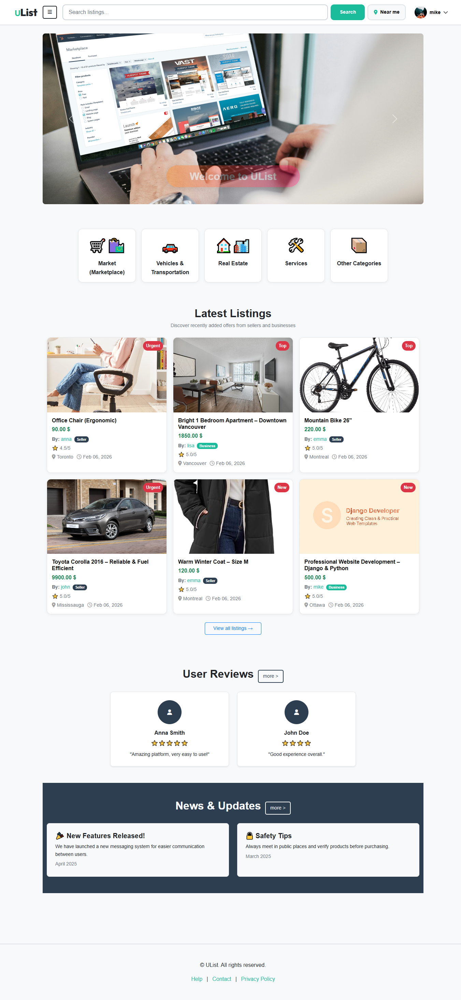
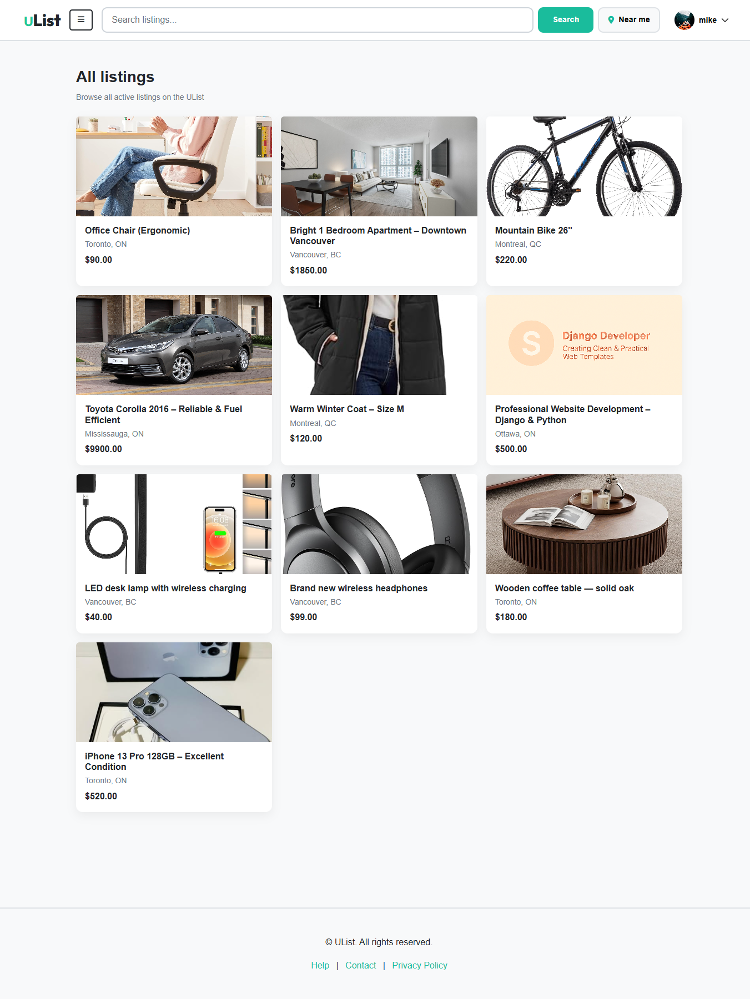
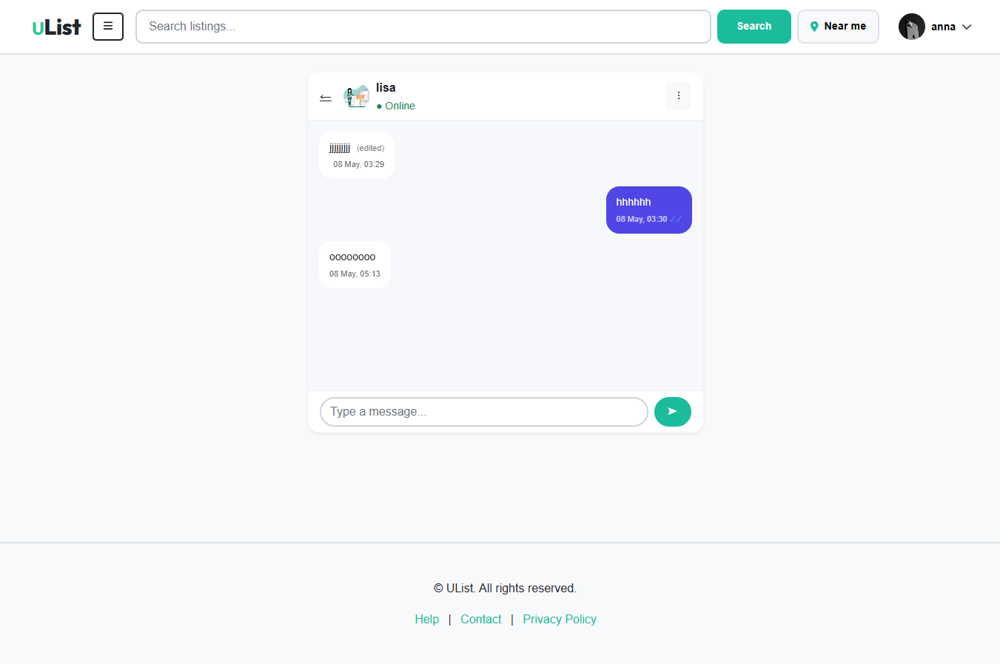
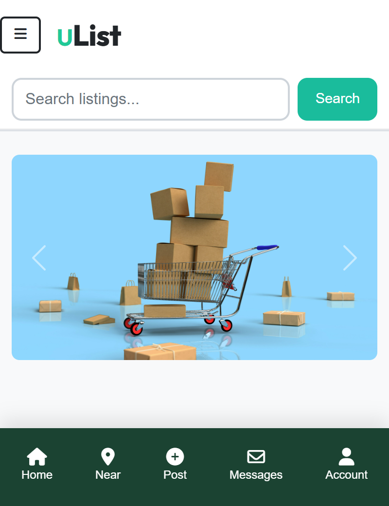

# UList — Django Classifieds Marketplace with Integrated Messaging

Modern Django marketplace platform inspired by Kijiji and Facebook Marketplace.

Built with Django 5 and Bootstrap 5, UList allows users to create listings, communicate through private conversations, save favorites, leave reviews, and discover listings nearby.

---

## 🚀 Live Demo

**Demo:** https://marketplace-codester.onrender.com

---

## 📸 Screenshots

### Homepage

### Listings

### Listing Details

### Private Messaging

### Seller Profile

### Mobile Version

---

## ✨ Features

### Marketplace & Listings

* Create, edit and manage listings
* Multiple images per listing
* Categories and subcategories
* Listing labels (New, Top, Urgent)
* Search and filtering
* Location support
* Responsive design

### Integrated Messaging

* Private conversations
* Inbox system
* Typing indicators
* Read receipts
* Online status
* Message editing
* Delete for everyone
* AJAX-powered updates
* No WebSockets required

### User Accounts

* Registration and authentication
* Public seller profiles
* Avatar support
* Seller ratings and reviews
* Favorites system
* Account management

### Administration

* Django Admin integration
* Listings moderation
* User management
* Category management
* Reviews and ratings management

---

## 💡 Perfect For

* Classified Ads Platforms
* Buy & Sell Websites
* Real Estate Portals
* Vehicle Marketplaces
* Rental Platforms
* Service Directories
* Startup MVPs
* Custom Client Projects

---

## 🛠 Technology Stack

* Python 3.12
* Django 5
* Bootstrap 5
* SQLite
* JavaScript
* AJAX / Fetch API

---

## 🎯 Highlights

✔ Integrated messaging system

✔ Typing indicators & read receipts

✔ Seller reviews & ratings

✔ Favorites system

✔ Nearby listings

✔ Mobile-friendly UI

✔ Easy customization

✔ Production-ready architecture

---

## 📦 Purchase

Interested in using UList for your project?

Available on Codester:

**Purchase Link:** [https://www.codester.com/items/62416/django-marketplace-classified-ads-platform?ref=Sulya]

---

## 📬 Feedback

I'd love to hear your feedback and suggestions.

Feel free to open an issue or contact me regarding custom development, feature requests, or business opportunities.
